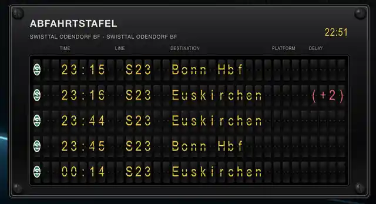
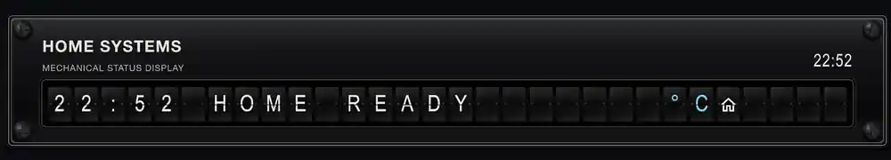
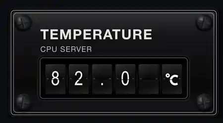
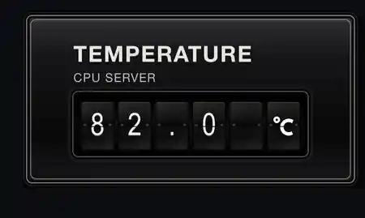

<p align="center">
  
</p>

# Split Flap Display Card

A photorealistic airport-style split-flap instrument for Home Assistant. The card combines a textured black aircraft-instrument housing, a recessed bezel, optional cross-head screws and independently animated mechanical flap cells.

**Current release: v0.2.31**

> All product images and the animation video in this repository are real Home Assistant captures. No synthetic product mock-ups are used.

## Real animation demo


**[Play the higher-quality MP4 animation demo](docs/images/split-flap-display-demo.mp4)**

The recording was captured directly from Home Assistant. The first five seconds were removed. The embedded looping GIF is generated from the trimmed MP4 during the release workflow, while the linked MP4 provides the higher-quality version.

## Real Home Assistant screenshots

### Public-transport departure board



### Free segment composition



### Compact value instrument with screws



### Compact value instrument without screws



## Features

- Photorealistic black aircraft-instrument housing
- Optional black cross-head mounting screws
- Independent upper and lower flap halves with a real two-stage `rotateX` movement
- Smooth first-load build from a completely empty board
- Direct or character-wheel animation
- Continuous `mixed` startup wave with restrained per-cell variation
- Short bounded wheel sequences that avoid full-board flicker
- Non-destructive replay without first clearing the populated board
- Adaptive parallelism for large displays
- Snapshot-safe Home Assistant updates that cannot mix two sensor states
- Structured public-transport departure-board mode without a template sensor
- Automatic bus, S-Bahn, U-Bahn, regional rail, ICE/ECE, IC/EC, train, tram and ferry classification
- Built-in German-style S-Bahn, U-Bahn, regional, ICE/ECE and IC/EC badges
- Separate colours for normal, delayed and cancelled departures
- Flexible text, spacer, entity, attribute, friendly-name, date/time and MDI-icon segments
- Responsive proportional scaling for desktop, tablet and mobile dashboards
- No external JavaScript, image or font dependency at runtime

## Installation through HACS

1. Open **HACS → Dashboard**.
2. Open **Custom repositories**.
3. Add `https://github.com/loungelizard2018/split-flap-display-card` as category **Dashboard**.
4. Install or redownload **Split Flap Display Card**.
5. Select release **v0.2.31**.
6. Choose **Update information** if HACS still shows an older README.
7. Reload the Home Assistant frontend without browser cache.

HACS registers:

```text
/hacsfiles/split-flap-display-card/split-flap-display-card.js
```

The browser console must report:

```text
SPLIT-FLAP-DISPLAY-CARD v0.2.31
```

## Dashboard sizing

Home Assistant Sections views divide each section into 12 columns. The card width and the internal instrument scale are controlled separately:

- `grid_options.columns` controls how much of the section the card occupies;
- `fit_to_card` allows the instrument to shrink to the available width;
- `allow_upscale` allows enlargement above the natural instrument size;
- `max_fit_scale` limits that enlargement;
- `visible_rows` controls the board height.

A balanced desktop size between half width and full width is:

```yaml
# Occupies 9 of the 12 section columns.
grid_options:
  columns: 9

# Fits the complete instrument into those columns.
fit_to_card: true

# Allows moderate enlargement, but prevents an oversized full-screen board.
allow_upscale: true
max_fit_scale: 1.25

# Reduces vertical height independently of width.
visible_rows: 5
```

Use `columns: 6` for half width, `columns: 9` for three-quarter width, and `columns: 12` or `full` for the complete section width. Avoid combining `columns: full` with a high `max_fit_scale` unless a wall-display-sized board is intended.

## Recommended departure-board configuration

The example below reads a structured `departures` attribute directly from a Home Assistant entity. Replace the example entity with your own public-transport sensor.

```yaml
# Registers the custom Lovelace card.
type: custom:split-flap-display-card

# Selects the structured public-transport renderer.
display_mode: departure_board

# Entity containing the departure list and station metadata.
entity: sensor.central_station_departures

# Attribute containing the individual departure records.
departure_attribute: departures

# Attribute used as the automatic subtitle below the title.
station_name_attribute: station_name

# Main heading shown above the board.
title: DEPARTURES

# Optional fixed subtitle.
# Leave empty to read station_name_attribute from the entity.
subtitle: ""

# Number of physical departure rows.
visible_rows: 5

# Shows TIME, LINE, DESTINATION, PLATFORM and DELAY headings.
show_column_headers: true

# Shows the current Home Assistant local time in the header.
show_header_clock: true

# Builds the board from empty cells when the card first appears.
animate_on_first_load: true

# wheel: shows several visible mechanical character changes.
# direct: performs one blank-to-final flap per populated cell.
initial_animation_style: wheel

# Keeps the empty board visible briefly before movement begins.
initial_animation_delay: 700

# Initial character used before the first-load build.
# A single space creates a completely empty board.
initial_fill_char: " "

# Startup patterns: simultaneous, wave, scatter or mixed.
# mixed is the recommended continuous wave with restrained variation.
initial_start_pattern: mixed

# Base delay between rows in milliseconds.
initial_row_stagger: 55

# Delay between successive populated cells in one row.
# Timing follows populated cells rather than absolute physical columns,
# so field separators do not create visible holes.
initial_cell_stagger: 6

# Maximum additional variation in mixed or scatter mode.
# mixed internally limits this jitter to preserve a continuous front.
initial_start_spread: 36

# short: uses a small bounded set of intermediate characters.
# full: traverses the complete physical character wheel.
initial_wheel_mode: short

# Minimum and maximum number of intermediate wheel steps.
initial_wheel_steps_min: 2
initial_wheel_steps_max: 4

# Maximum number of simultaneously moving startup cells.
initial_max_parallel_cells: 24

# Duration of one character-wheel step in milliseconds.
step_duration: 52

# Allows replay by clicking the instrument or pressing Enter/Space.
# Set false for a dashboard where accidental replay is undesirable.
replay_on_tap: true

# Later sensor changes use one direct flap to the new value.
live_update_style: direct

# Starts all changed rows from one sensor snapshot together.
start_mode: simultaneous

# No additional delay between changed live rows.
live_row_stagger: 0

# Duration of one direct live-update flap.
flip_duration: 140

# Used only when live_update_style is wheel.
cell_stagger: 4

# Used only by sequential live wheel updates.
max_parallel_cells: 1

# Fits the complete instrument proportionally into its Lovelace column.
fit_to_card: true

# Prevents enlargement above the natural physical size.
allow_upscale: false

# Maximum enlargement factor when allow_upscale is true.
max_fit_scale: 1

# Shows four aircraft-instrument-style mounting screws.
screws: true

# Removes the normal Home Assistant card surface around the instrument.
transparent_card: true

# Natural physical cell dimensions before responsive scaling.
cell_width: 34
cell_height: 50

# Horizontal gap between adjacent cells and vertical gap between rows.
cell_gap: 3
row_gap: 8

# Typography controls.
glyph_weight: 500
glyph_scale: 0.61
glyph_offset_y: -1.5

# Physical width of each departure-board field.
board_columns:
  # Transport badge or icon.
  mode: 2

  # Departure time, for example 18:45.
  time: 5

  # Line designation, for example S23 or 747.
  line: 5

  # Destination text. Longer values are clipped to this width.
  destination: 20

  # Platform, track or bus bay.
  platform: 3

  # Delay or cancellation information.
  delay: 6

  # Empty cells inserted between adjacent fields.
  gap: 1

# Colours used for structured departure data.
departure_colors:
  # Normal and on-time information.
  normal: "#f2c400"

  # Positive or negative delay information.
  delayed: "#ff5263"

  # Cancelled departures.
  cancelled: "#ff3347"

  # Column headings.
  header: "#aaa89e"

# Maps detected transport modes to built-in badges or MDI icons.
transport_icon_map:
  # Standard bus icon.
  bus: mdi:bus

  # Green circular German-style S-Bahn badge.
  sbahn: splitflap:sbahn

  # Light ICE/ECE badge with a red lower stripe.
  ice: splitflap:ice

  # Light IC/EC badge with a red lower stripe.
  ic: splitflap:ic

  # Generic train icon for unclassified rail services.
  train: mdi:train

  # RE, RB, IRE or MEX badge selected from the line prefix.
  regional: splitflap:regional

  # Blue German-style U-Bahn badge.
  subway: splitflap:ubahn

  # Tram or streetcar icon.
  tram: mdi:tram

  # Ferry icon.
  ferry: mdi:ferry

  # Fallback for an unclassified transport type.
  unknown: mdi:transit-connection-variant
```

The same fully commented example is stored in:

```text
examples/openpublictransport-departure-board.yaml
```

## Expected departure data

The integration entity must expose an array in the configured `departure_attribute`.

```yaml
station_name: Central Station

departures:
  - line: S8
    destination: Airport
    departure_time: "18:45"
    planned_time: "18:43"
    delay: 2
    platform: "3"
    transportation_type: train
    is_realtime: true
    cancelled: false
```

The card uses:

| Field | Behaviour |
|---|---|
| `line` | Public line designation and transport-mode classification |
| `destination` | Destination text |
| `departure_time` | Preferred displayed time |
| `planned_time` | Fallback when `departure_time` is empty |
| `delay` | Delay in minutes; positive values display as `(+4)` |
| `platform` | Platform, track or bus bay |
| `transportation_type` | Generic fallback classification |
| `cancelled` or `is_cancelled` | Displays `CANCEL` using the cancellation colour |

### Automatic transport classification

| Line or type | Detected mode |
|---|---|
| `S8`, `S23` | S-Bahn |
| `U2` | U-Bahn |
| `RE1`, `RB48`, `IRE`, `MEX` | Regional badge based on the prefix |
| `ICE`, `ECE` | ICE/ECE badge |
| `IC`, `EC` | IC/EC badge |
| `transportation_type: bus` | Bus |
| `transportation_type: tram` or `streetcar` | Tram |
| `transportation_type: ferry` | Ferry |
| `transportation_type: train` or `rail` | Generic train |

The built-in badges are original local CSS/vector renderings inspired by familiar German transport signage. They are not bundled official operator logo files.

## Free segment mode

Segment mode combines independent values in one physical row. A row may contain fixed text, spacers, entity states, attributes, friendly names, date/time values and icons.

```yaml
# Registers the custom Lovelace card.
type: custom:split-flap-display-card

# Selects free segment composition.
display_mode: segments

# Instrument headings.
title: HOME SYSTEMS
subtitle: MECHANICAL STATUS DISPLAY

# Total number of physical cells per row.
columns: 30

# Fits the complete instrument into the available card width.
fit_to_card: true
allow_upscale: false

# Builds the display from empty cells on first load.
animate_on_first_load: true
initial_animation_style: wheel
initial_animation_delay: 450
initial_start_pattern: mixed
initial_row_stagger: 55
initial_cell_stagger: 6
initial_start_spread: 36
initial_wheel_mode: short
initial_wheel_steps_min: 2
initial_wheel_steps_max: 4
initial_max_parallel_cells: 24
step_duration: 52

# Uses direct updates after the first-load build.
live_update_style: direct
start_mode: simultaneous
flip_duration: 140

# Defines the physical rows and their independent segments.
rows:
  - # Aligns the combined row content from the left.
    # Supported values: left, centre/center or right.
    align: left

    segments:
      - # Formats a date/time entity.
        type: datetime
        entity: sensor.example_date_time
        format: "HH:mm"
        width: 5

      - # Reserves one empty physical cell.
        type: spacer
        width: 1

      - # Displays fixed literal text.
        type: text
        value: HOME READY
        width: 12

      - # Another empty cell.
        type: spacer
        width: 1

      - # Displays and formats a numeric entity state.
        type: entity
        entity: sensor.example_temperature
        decimals: 1
        suffix: "°C"
        width: 6
        align: right
        color: "#79d7ff"

      - # Displays a fixed Material Design icon.
        type: icon
        icon: mdi:home-outline
        width: 1
        color: "#79d7ff"
```

### Supported segment types

| Type | Required fields | Purpose |
|---|---|---|
| `text` | `value` | Fixed literal text |
| `spacer` | `width` | Fixed number of empty cells |
| `entity` | `entity` | Entity state |
| `attribute` | `entity`, `attribute` | Entity attribute |
| `friendly_name` | `entity` | Entity friendly name |
| `datetime` | `entity` | Formatted date/time state |
| `icon` | `icon` | Fixed MDI or built-in icon |
| `entity_icon` | `entity` | Icon from the entity, optionally using `fallback_icon` |

### Segment formatting fields

| Field | Purpose |
|---|---|
| `width` | Number of physical cells reserved for the segment |
| `align` | `left`, `center` or `right` alignment inside the segment |
| `pad` | Padding character; defaults to a space |
| `overflow` | Overflow handling; clipped by default |
| `prefix` / `suffix` | Text added before or after the resolved value |
| `uppercase` | Overrides the card-level uppercase behaviour |
| `decimals` | Numeric decimal places for entity or attribute values |
| `format` | Date/time format for `datetime` segments |
| `color` | CSS colour applied to the segment glyphs |

## Configuration reference

### General and layout

| Option | Default | Description |
|---|---:|---|
| `display_mode` | `segments` | `segments` or `departure_board` |
| `title` | `DEPARTURES` in board mode | Main heading |
| `subtitle` | empty | Fixed subtitle; overrides the station-name attribute |
| `columns` | calculated / `28` | Total physical cells per row |
| `uppercase` | `true` | Converts textual segment values to uppercase unless overridden |
| `character_set` | `airport_de` | Physical character wheel: `airport_de`, `alphanumeric` or `numeric` |
| `screws` | `true` | Shows four mounting screws |
| `transparent_card` | `true` | Removes the normal Home Assistant card surface |
| `fit_to_card` | `true` | Scales the complete instrument to the available width |
| `allow_upscale` | `false` | Allows enlargement above natural size |
| `max_fit_scale` | `1` | Maximum responsive enlargement factor |
| `cell_width` | `34` | Natural cell width in pixels |
| `cell_height` | `50` | Natural cell height in pixels |
| `cell_gap` | `3` | Horizontal gap in pixels |
| `row_gap` | `8` | Vertical gap in pixels |
| `text_color` | `#f2f1e9` | Default glyph colour in segment mode |
| `glyph_weight` | `500` | Glyph font weight |
| `glyph_scale` | `0.61` | Glyph size relative to cell height |
| `glyph_offset_y` | `-1.5` | Vertical glyph correction in pixels |

### First-load animation

| Option | Default | Description |
|---|---:|---|
| `animate_on_first_load` | `true` | Plays the startup build |
| `initial_animation_delay` | `450` | Delay before startup begins, in ms |
| `initial_fill_char` | space | Initial physical character |
| `initial_animation_style` | `direct` | `direct` or `wheel` |
| `initial_flip_duration` | `220` | Direct startup flap duration, in ms |
| `initial_start_pattern` | `mixed` in board mode | `simultaneous`, `wave`, `scatter` or `mixed` |
| `initial_row_stagger` | inherited / `120` | Base delay between rows, in ms |
| `initial_cell_stagger` | `6` | Delay between populated cells, in ms |
| `initial_start_spread` | `36` | Additional variation for mixed/scatter, in ms |
| `initial_wheel_mode` | `short` | `short` or `full` character-wheel path |
| `initial_wheel_steps_min` | `3` | Minimum intermediate steps in short mode |
| `initial_wheel_steps_max` | `6` | Maximum intermediate steps in short mode |
| `initial_max_parallel_cells` | `24` | Requested maximum simultaneous startup cells; the runtime may adapt it down |
| `animation_performance` | `auto` | `auto`, `quality`, `balanced` or `fast` CPU/GPU profile |
| `replay_on_tap` | `false` | Enables click and keyboard replay |

### Live updates

| Option | Default | Description |
|---|---:|---|
| `live_update_style` | `direct` in board mode | `direct` or `wheel` |
| `start_mode` | `sequential` | `sequential` or `simultaneous` |
| `live_row_stagger` | `0` | Delay between changed rows, in ms |
| `flip_duration` | `136` | Direct update duration, in ms |
| `step_duration` | `72` | Character-wheel step duration, in ms |
| `cell_stagger` | `4` in board mode | Delay between live wheel cells, in ms |
| `max_parallel_cells` | `1` | Worker count for sequential live wheel updates |

### Departure-board fields

| Option | Default | Description |
|---|---:|---|
| `entity` | required | Entity containing the departure data |
| `departure_attribute` | `departures` | Array attribute containing departure records |
| `station_name_attribute` | `station_name` | Attribute used as the automatic subtitle |
| `visible_rows` | `8` | Number of departure rows |
| `show_column_headers` | `true` | Shows field headings |
| `show_header_clock` | `true` | Shows Home Assistant local time |
| `board_columns` | object | Width of mode, time, line, destination, platform, delay and gaps |
| `departure_colors` | object | Normal, delayed, cancelled and header colours |
| `transport_icon_map` | object | Transport-mode badge or icon mapping |

## Animation behaviour

### Smooth startup flow

The recommended `mixed` startup is not random scattering. It is a compact left-to-right wave based on the order of populated cells, with only restrained jitter. Spaces between TIME, LINE and DESTINATION therefore do not create timing gaps.

Once a cell starts, it completes its short wheel sequence before its animation slot is reused. Large boards automatically reduce parallel compositor work and intermediate steps when necessary.

### Animation performance profiles

Large boards can contain several hundred physical cells. Each active cell has two 3D flap halves, so unrestricted parallel animation can overload an older GPU even when the JavaScript scheduler itself is fast.

```yaml
# auto: selects a profile from board size and available CPU threads.
# quality: full effects and maximum parallelism.
# balanced: removes expensive temporary effects and reduces parallelism.
# fast: lowest animation load for older PCs and large wall dashboards.
animation_performance: auto
```

The balanced and fast profiles temporarily disable the instrument-level drop-shadow filter, glass overlays and impact animation while the flaps move. The complete photorealistic appearance returns immediately after the animation settles.

For a visibly struggling browser, use:

```yaml
animation_performance: fast
initial_wheel_steps_min: 2
initial_wheel_steps_max: 4
initial_max_parallel_cells: 24
step_duration: 52
```

### Replay

With `replay_on_tap: true`, click the instrument or press Enter/Space while it is focused. Replay is non-destructive: existing characters remain visible until their individual flap starts moving.

### Sensor updates

Home Assistant sensor changes are processed as complete snapshots. If another state arrives during an active transition, the current transition finishes and only the newest queued snapshot is applied. This prevents characters from two departure states appearing in the same row.

## Troubleshooting

### Startup animation repeats instead of settling

The startup build is deliberately one-shot. If a browser timer is interrupted or Home Assistant briefly reattaches the card, the animation stops retrying and the card settles immediately on the latest complete sensor snapshot. It will only run again after a page reload or an explicit click when `replay_on_tap: true`.


### HACS shows an older README

Choose **Update information** in the HACS repository menu, then reload the HACS page.

### The browser still runs an older JavaScript version

Perform a cache-free reload and verify:

```text
SPLIT-FLAP-DISPLAY-CARD v0.2.28
```

### Rows appear but no flap motion is visible

Use an obvious diagnostic configuration:

```yaml
initial_animation_style: wheel
initial_wheel_mode: short
initial_wheel_steps_min: 2
initial_wheel_steps_max: 4
step_duration: 120
replay_on_tap: true
```

Then click the card once after it has settled.

### The startup looks too busy

Reduce the number of steps and moving cells:

```yaml
initial_wheel_steps_min: 2
initial_wheel_steps_max: 4
initial_max_parallel_cells: 24
initial_start_spread: 36
```

### The startup contains visible holes

Use the continuous mixed wave and avoid `scatter`:

```yaml
initial_start_pattern: mixed
initial_row_stagger: 55
initial_cell_stagger: 6
initial_start_spread: 36
```

### A destination is truncated

Increase `board_columns.destination`. When `columns` is not set manually, the total physical width is recalculated automatically.

### Live data appears shifted or mixed

Use stable direct updates:

```yaml
live_update_style: direct
start_mode: simultaneous
live_row_stagger: 0
```

### Startup does not stop

The startup controller is one-shot. Install the current release and perform a cache-free reload. An interrupted startup settles on the latest complete sensor snapshot instead of restarting itself.

## Recording your own demo

A fully commented recording configuration is stored in:

```text
examples/video-recording-demo.yaml
```

On macOS:

1. Open the dashboard and wait until the card has settled.
2. Press `Cmd + Shift + 5`.
3. Select **Record Selected Portion**.
4. Draw the capture region around the instrument.
5. Start recording.
6. Click the instrument once when `replay_on_tap: true`.
7. Wait two seconds after the final flap settles.
8. Stop recording from the macOS menu bar.

Trim and compress with FFmpeg:

```bash
ffmpeg \
  -ss 5 \
  -i input.mov \
  -an \
  -vf "scale=360:-2:flags=lanczos,fps=10" \
  -c:v libx264 \
  -crf 35 \
  -preset slow \
  -pix_fmt yuv420p \
  -movflags +faststart \
  docs/images/split-flap-display-demo.mp4
```

## Development

Run syntax checks and regression tests:

```bash
npm run check
```

The automated tests cover:

- complete and atomic sensor snapshots;
- queued state replacement;
- mixed-case and German-character wheel targets;
- German transport badge rendering;
- bounded startup wheel sequences;
- continuous startup timing without physical-column gaps;
- adaptive flow scheduling;
- final-token settlement;
- one-shot replay and startup behaviour.

Repository structure:

```text
split-flap-display-card.js       Main custom element and lifecycle
split-flap-config.js             Configuration validation and defaults
split-flap-render.js             DOM and physical-cell construction
split-flap-update.js             Sensor snapshot and live-update engine
split-flap-performance.js        Web Animations startup and replay engine
split-flap-flow-scheduler.js     Continuous bounded startup scheduler
split-flap-start-patterns.js     Startup timing patterns
split-flap-wheel-start.js        Short and full character-wheel paths
split-flap-transport-badges.js   Built-in transport badges
split-flap-styles.js             Instrument, flap and typography CSS
split-flap-utils.js              Tokens, colours and character sets
examples/                        Fully commented Lovelace examples
docs/images/                     Real screenshots, branding and video
tests/                           Regression tests
```

## Credits

The behaviour of existing Home Assistant split-flap projects, including `RazManSource/splitflap-card`, was reviewed as reference. This card uses an independent deterministic animation, scheduling and snapshot engine.

## Licence

MIT
