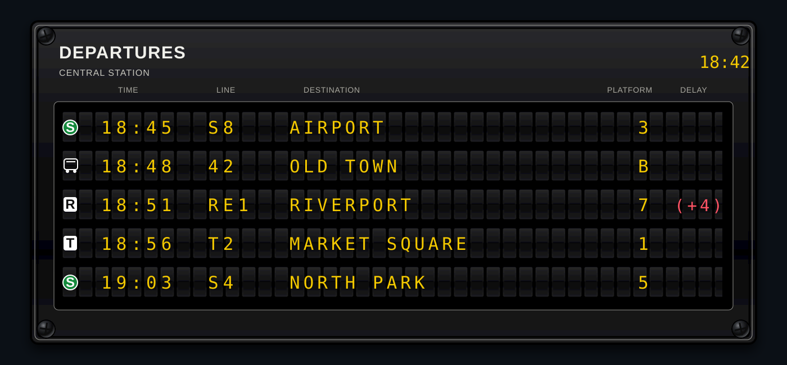
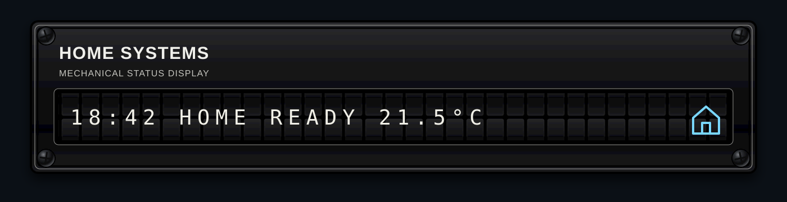
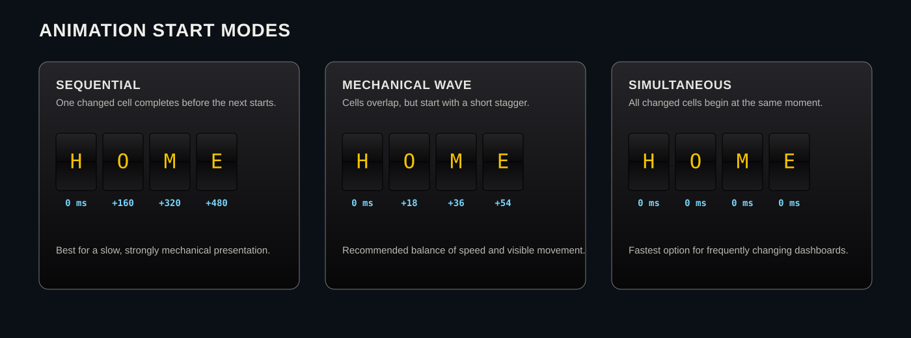

# Split Flap Display Card

A photorealistic airport-style split-flap instrument for Home Assistant. It combines a textured black aircraft-instrument housing, recessed bezel, cross-head screws and independently animated mechanical flap cells.

**Current release: v0.2.3**

## Visual examples

### Public-transport departure board

The departure-board mode reads a structured `departures` attribute directly from a Home Assistant entity, classifies transport types, renders a German-style S-Bahn badge and highlights delays or cancellations.

<p align="center">
  
</p>

### Free segment display

The segment mode combines independent text, entity, attribute, date/time and MDI-icon segments in one physical row.

<p align="center">
  
</p>

### Animation variants

The same mechanical character-wheel animation can start strictly one cell at a time, as a short overlapping wave or fully simultaneously.

<p align="center">
  
</p>

The images above are repository-owned SVG visualisations of real card configurations. They contain no external image or font dependency.

## Features

- Photorealistic black instrument housing matching the companion Analog Gauge Card and Mechanical Counter Card
- Independent upper and lower flap halves with a true two-stage `rotateX` animation
- Deterministic forward movement through a physical character wheel instead of random scrambling
- Atomic refresh handling so a new sensor update cannot mix characters from old and new rows
- Sequential, overlapping-wave and simultaneous start behaviour
- Direct structured departure-board mode without a template sensor
- Automatic recognition of bus, S-Bahn, regional train, long-distance train, subway, tram and ferry services
- Built-in green S-Bahn badge inspired by the familiar German S-Bahn visual language
- Separate colours for normal, delayed and cancelled departures
- Free composition from text, spacers, entity states, attributes, friendly names, date/time values and MDI icons
- Per-segment width, alignment, padding, prefixes, suffixes, numeric formatting and colour
- Responsive proportional fitting for desktop, tablet and mobile dashboards
- No external JavaScript, image or font dependencies

## Installation through HACS

1. Open **HACS → Dashboard**.
2. Open **Custom repositories**.
3. Add `https://github.com/loungelizard2018/split-flap-display-card` as category **Dashboard**.
4. Install or redownload **Split Flap Display Card**.
5. Select release **v0.2.3**.
6. Reload the Home Assistant frontend without browser cache.

HACS registers the main module at:

```text
/hacsfiles/split-flap-display-card/split-flap-display-card.js
```

The browser console should report:

```text
SPLIT-FLAP-DISPLAY-CARD v0.2.3
```

## Complete departure-board example

This generic example assumes an entity called `sensor.central_station_departures` whose `departures` attribute contains structured departure records.

```yaml
# Registers the custom Lovelace card.
type: custom:split-flap-display-card

# Selects the structured public-transport board renderer.
display_mode: departure_board

# Entity containing the departure list and station metadata.
entity: sensor.central_station_departures

# Attribute containing the list of departure records.
departure_attribute: departures

# Attribute used as the automatic subtitle below the card title.
station_name_attribute: station_name

# Main title printed in the instrument heading.
title: DEPARTURES

# Optional fixed subtitle; omit it to use station_name_attribute automatically.
subtitle: ""

# Number of departure rows physically rendered by the card.
visible_rows: 5

# Shows the TIME, LINE, DESTINATION, PLATFORM and DELAY headings.
show_column_headers: true

# Shows the current Home Assistant local time in the top-right corner.
show_header_clock: true

# Starts all changed cells independently instead of waiting for the prior cell.
start_mode: simultaneous

# Adds a short delay between cell starts; 0 means exactly simultaneous.
cell_stagger: 4

# Duration in milliseconds of one character-wheel step.
step_duration: 58

# Duration in milliseconds for a direct icon or special-token flap.
flip_duration: 118

# Shrinks the complete physical instrument proportionally to the card width.
fit_to_card: true

# Prevents enlargement above the natural physical instrument size.
allow_upscale: false

# Maximum enlargement factor when allow_upscale is enabled.
max_fit_scale: 1

# Shows four aircraft-instrument-style cross-head screws.
screws: true

# Removes the normal Home Assistant card background around the instrument.
transparent_card: true

# Natural width of one physical flap cell before responsive scaling.
cell_width: 34

# Natural height of one physical flap cell before responsive scaling.
cell_height: 50

# Horizontal space between adjacent physical cells.
cell_gap: 3

# Vertical space between departure rows.
row_gap: 8

# Font weight used for letters and numbers on every flap.
glyph_weight: 500

# Character size as a fraction of the configured cell height.
glyph_scale: 0.61

# Vertical character offset; the default keeps E, F and H centre strokes visible.
glyph_offset_y: -1.5

# Configures the physical width of each departure-board field.
board_columns:
  # Number of cells reserved for the transport symbol.
  mode: 2

  # Number of cells reserved for the departure time.
  time: 5

  # Number of cells reserved for the line designation.
  line: 5

  # Number of cells reserved for the destination text.
  destination: 20

  # Number of cells reserved for the platform or bay.
  platform: 3

  # Number of cells reserved for delay or cancellation information.
  delay: 6

  # Number of empty physical cells inserted between adjacent fields.
  gap: 1

# Controls the text colours used by structured departure rows.
departure_colors:
  # Colour for on-time departures and normal route information.
  normal: "#f2c400"

  # Colour for positive or negative delay values.
  delayed: "#ff5263"

  # Colour for cancelled departures.
  cancelled: "#ff3347"

  # Colour for the column headings above the flap rows.
  header: "#aaa89e"

# Maps detected transport modes to built-in or Material Design icons.
transport_icon_map:
  # Standard bus symbol.
  bus: mdi:bus

  # Built-in green S-Bahn badge with a white S.
  sbahn: splitflap:sbahn

  # Generic train or long-distance rail symbol.
  train: mdi:train

  # Regional rail symbol used for RE, RB, R, IRE and MEX lines.
  regional: mdi:train

  # Subway or underground symbol.
  subway: mdi:subway-variant

  # Tram or streetcar symbol.
  tram: mdi:tram

  # Ferry symbol.
  ferry: mdi:ferry

  # Fallback symbol when no transport type can be classified.
  unknown: mdi:transit-connection-variant
```

## Expected departure data

The card reads an array from the configured `departure_attribute`. Each record may contain the fields below.

```yaml
# Human-readable station name used as the automatic subtitle.
station_name: Central Station

# List of upcoming departures rendered from top to bottom.
departures:
  # First departure record.
  - # Public line designation.
    line: S8

    # Destination shown in the destination field.
    destination: Airport

    # Realtime departure time displayed by the card.
    departure_time: "18:45"

    # Scheduled departure time used when no realtime time is available.
    planned_time: "18:43"

    # Delay in minutes; positive values are late and negative values are early.
    delay: 2

    # Platform, track or bus bay text.
    platform: "3"

    # Generic mode supplied by the integration.
    transportation_type: train

    # Indicates whether realtime information was available.
    is_realtime: true

    # Optional explicit cancellation flag.
    cancelled: false
```

The board uses `departure_time` first and falls back to `planned_time`. It recognises common line prefixes in addition to `transportation_type`:

| Line or type | Detected mode |
|---|---|
| `S8`, `S23` | S-Bahn |
| `U2` | Subway |
| `RE1`, `RB48`, `IRE`, `MEX` | Regional train |
| `ICE`, `IC`, `EC` | Train |
| `transportation_type: bus` | Bus |
| `transportation_type: tram` | Tram |
| `transportation_type: ferry` | Ferry |

A positive delay is shown as `(+4)`. A cancellation is shown as `CANCEL`. Only the delay or cancellation field changes to the configured warning colour.

## Animation modes

### Strictly sequential

Use this for the slowest and most visibly mechanical presentation.

```yaml
# Starts changed cells through a bounded worker queue.
start_mode: sequential

# Allows exactly one physical cell to animate at a time.
max_parallel_cells: 1

# Waits this many milliseconds before starting the next changed cell.
cell_stagger: 60
```

### Mechanical wave

Use this as the recommended balance of speed and visible motion.

```yaml
# Starts every changed cell independently.
start_mode: simultaneous

# Introduces a short left-to-right and top-to-bottom start wave.
cell_stagger: 4
```

### Fully simultaneous

Use this for frequently changing dashboards where update speed is more important than staggered motion.

```yaml
# Starts every changed cell independently.
start_mode: simultaneous

# Removes all delay between cell starts.
cell_stagger: 0
```

Every text cell still advances through the ordered character wheel. A change from `A` to `D` therefore shows `A → B → C → D`. An MDI or built-in icon uses one complete direct flap because a physical wheel cannot plausibly contain the complete MDI library.

## Free segment mode

Segment mode creates one or more fixed physical rows from independent content blocks.

```yaml
# Registers the custom Lovelace card.
type: custom:split-flap-display-card

# Selects the free segment-composition renderer.
display_mode: segments

# Main title printed above the flap rows.
title: HOME SYSTEMS

# Optional secondary heading below the title.
subtitle: MECHANICAL STATUS DISPLAY

# Total number of physical flap cells in every row.
columns: 30

# Starts changed cells independently for a fast mechanical wave.
start_mode: simultaneous

# Adds a small start delay between adjacent changed cells.
cell_stagger: 6

# Defines the physical rows shown by the card.
rows:
  # First physical display row.
  - # Aligns the combined row content from the left edge.
    align: left

    # Ordered independent content segments in this row.
    segments:
      # Displays a formatted date/time sensor value.
      - # Selects the date/time formatter.
        type: datetime

        # Entity providing an ISO date/time state.
        entity: sensor.example_date_time

        # Output pattern using 24-hour time.
        format: "HH:mm"

        # Reserves five physical cells for the formatted time.
        width: 5

      # Inserts one empty physical flap cell.
      - # Selects a fixed empty segment.
        type: spacer

        # Number of empty physical cells inserted.
        width: 1

      # Displays fixed text.
      - # Selects a literal text segment.
        type: text

        # Text written across the reserved cells.
        value: HOME READY

        # Reserves twelve cells and pads unused cells with spaces.
        width: 12

      # Inserts another empty physical flap cell.
      - # Selects a fixed empty segment.
        type: spacer

        # Number of empty physical cells inserted.
        width: 1

      # Displays a numeric Home Assistant entity.
      - # Selects an entity-state segment.
        type: entity

        # Entity whose state is displayed.
        entity: sensor.example_temperature

        # Rounds numeric states to one decimal place.
        decimals: 1

        # Appends the configured unit text after the value.
        suffix: "°C"

        # Reserves six physical cells for value and unit.
        width: 6

        # Right-aligns the formatted value inside the reserved cells.
        align: right

        # Uses a light blue character colour for this segment.
        color: "#79d7ff"

      # Displays a Material Design icon in one physical cell.
      - # Selects a fixed icon segment.
        type: icon

        # Material Design icon name rendered by Home Assistant.
        icon: mdi:home-outline

        # Reserves one physical cell for the icon.
        width: 1

        # Uses the same light blue colour as the temperature segment.
        color: "#79d7ff"
```

### Supported segment types

| Type | Purpose |
|---|---|
| `text` | Fixed literal text |
| `spacer` | Fixed number of empty cells |
| `entity` | Home Assistant entity state |
| `attribute` | One attribute from a Home Assistant entity |
| `friendly_name` | Entity `friendly_name` attribute |
| `datetime` | Formatted date/time state |
| `icon` | Fixed MDI icon |
| `entity_icon` | Icon read from an entity |

### Common segment fields

| Field | Purpose |
|---|---|
| `width` | Number of physical cells reserved by the segment |
| `align` | `left`, `center` or `right` alignment inside the reserved cells |
| `pad` | Character used to fill unused cells |
| `prefix` / `suffix` | Text added before or after the source value |
| `uppercase` | Overrides the card-wide uppercase conversion |
| `overflow` | Currently clips text that exceeds `width` |
| `decimals` | Numeric decimal places for entity values |
| `decimal_separator` | Set to `,` to replace the decimal point |
| `use_entity_unit` | Appends `unit_of_measurement` from the entity |
| `unit_separator` | Text inserted before the entity unit |
| `color` | CSS colour used by the segment glyphs |

## Card options reference

### General and housing

| Option | Default | Description |
|---|---:|---|
| `display_mode` | `segments` | `segments` or `departure_board` |
| `title` | mode-dependent | Main heading |
| `subtitle` | empty | Fixed secondary heading; overrides station metadata |
| `screws` | `true` | Shows four instrument screws |
| `transparent_card` | `true` | Removes the normal Home Assistant card surface |
| `fit_to_card` | `true` | Proportionally shrinks the complete instrument |
| `allow_upscale` | `false` | Allows enlargement above natural size |
| `max_fit_scale` | `1` | Maximum enlargement factor |

### Cell geometry and typography

| Option | Default | Description |
|---|---:|---|
| `cell_width` | `34` | Natural cell width in pixels |
| `cell_height` | `50` | Natural cell height in pixels |
| `cell_gap` | `3` | Horizontal gap between cells |
| `row_gap` | `8` | Vertical gap between rows |
| `text_color` | `#f2f1e9` | Default segment-mode glyph colour |
| `glyph_weight` | `500` | Glyph font weight |
| `glyph_scale` | `0.61` | Glyph size relative to cell height |
| `glyph_offset_y` | `-1.5` | Vertical glyph adjustment |
| `character_set` | `airport_de` | Ordered physical character wheel |
| `uppercase` | `true` | Converts segment text to uppercase |

### Animation

| Option | Default | Description |
|---|---:|---|
| `start_mode` | `sequential` | `sequential` or `simultaneous` |
| `max_parallel_cells` | `1` | Worker count in sequential mode |
| `cell_stagger` | `18` | Start delay in milliseconds |
| `step_duration` | `72` | Duration of one character-wheel step |
| `flip_duration` | `136` | Duration of direct icon/special-token flips |

### Departure-board data and layout

| Option | Default | Description |
|---|---:|---|
| `entity` | required | Entity containing departure data |
| `departure_attribute` | `departures` | Attribute containing the departure array |
| `station_name_attribute` | `station_name` | Attribute used as the automatic subtitle |
| `visible_rows` | `8` | Number of physical departure rows |
| `show_column_headers` | `true` | Shows board field headings |
| `show_header_clock` | `true` | Shows current Home Assistant local time |
| `board_columns` | see example | Physical field widths and gaps |
| `departure_colors` | see example | Normal, delayed, cancelled and heading colours |
| `transport_icon_map` | built in | Transport-mode icon overrides |

## Update consistency

Home Assistant integrations often replace the complete departure list while the previous flap animation is still running. The card treats every new data snapshot atomically:

1. It invalidates the prior animation generation.
2. It cancels pending timers.
3. It returns any half-flipped cell to a stable state.
4. It assigns the complete new target board.
5. It starts a fresh animation only from the stable current state.

This prevents destinations from different snapshots being combined within one row.

## Troubleshooting

### HACS still shows an older README

HACS displays the README belonging to the installed release tag. Select the current release explicitly under **Redownload** and reload the HACS page.

### The browser still runs an older JavaScript version

Perform a cache-free reload and verify the console message:

```text
SPLIT-FLAP-DISPLAY-CARD v0.2.3
```

### The card is blank in departure-board mode

Confirm that:

- `entity` exists;
- `departure_attribute` points to an array;
- each array item contains at least `line`, `destination` and either `departure_time` or `planned_time`.

### A destination is truncated

Increase `board_columns.destination`. The complete board width is calculated automatically when `columns` is not specified manually.

## Development

Run the JavaScript syntax checks before committing:

```bash
npm run check
```

Repository structure:

```text
split-flap-display-card.js   Main custom element and module loader
split-flap-config.js         Configuration validation and normalisation
split-flap-render.js         DOM and physical-cell construction
split-flap-update.js         Data adapters, animation queue and atomic refresh logic
split-flap-styles.js         Instrument, flap, typography and animation CSS
split-flap-utils.js          Tokens, colours, character sets and shared helpers
examples/                    Fully commented Lovelace examples
docs/images/                 Repository-owned example visualisations
```

## Credits

The behaviour of existing Home Assistant split-flap projects, including `RazManSource/splitflap-card`, was reviewed as reference. This card uses an independent deterministic animation engine rather than random character scrambling.

The built-in S-Bahn badge is an original local SVG/CSS-style rendering inspired by the familiar German green-circle-and-white-S convention; it does not download or bundle a third-party logo image.

## Licence

MIT
